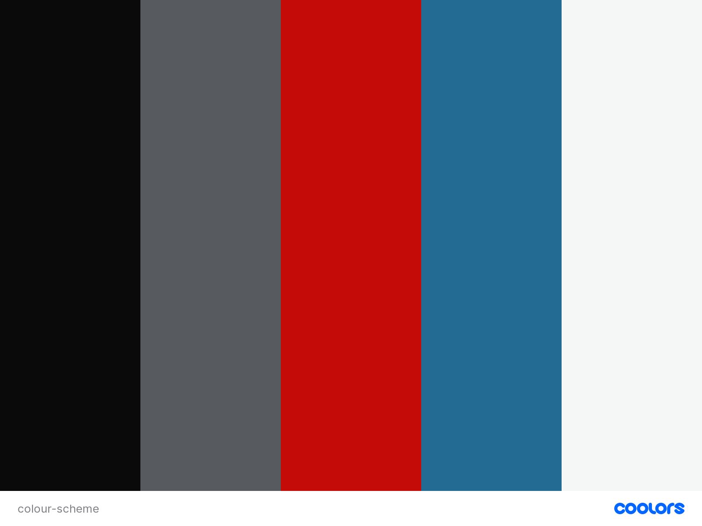

# Guled Investment Group 

## Contents 
---
  * [UX (User Experience)](#ux--user-experience-)
    + [Project Goals](#project-goals)
    + [User Goals](#user-goals)
    + [User Stories](#user-stories)
    + [Site Owner Goals](#site-owner-goals)
    + [User Requirements and Expectations](#user-requirements-and-expectations)
    + [Design Choices](#design-choices)
    + [Wireframing](#wireframing)
  * [Technologies Used](#technologies-used)
  * [Features](#features)
  * [Testing](#testing)
  * [Bugs](#bugs)
  * [Deployment](#deployment)
  * [References](#references)
    + [Code References](#code-references)
    + [Investment Information Sources](#investment-information-sources)
    + [Image Sources](#image-sources)
    + [Special Thanks](#special-thanks)

## UX (User Experience) 
---
### Project Goals 

The **goal** for this project is to **introduce** to **potential investors** an investment fund managed by **Guled Investment Group**, including: what an investment fund is, who manages it and commission fee structure.

### User Goals 

* **Learn and Understand** what an investment fund is and how it works.
* **Find out** whether investing into an investment fund is viable and beneficial to user. 
* **Contact the company** for **more information** and request to be contacted, by providing contact details, to **learn more** about:
    * How **investment funds** work. 
    * The company's **profit sharing** and **commission structure**.
* **Learn more** about the **investment managers**: their investing background and credentials.
* **Be reassured** that the investment fund and company, that includes investment managers, are appropriately  **accredited** and **licensed**.
 
### User Stories 

* As a **user**, I want an **informative** and **well-structured website** so I will be **properly informed without confusion**.
* As a **user**, I want to **understand** what an **investment fund** in a **language I can understand** without **too much financial jargon**.
* As a **user**, I want to be able to **easily contact the customer service** so I can ask **questions for clarification and understand better.** 
* As a **user**, I want to be **reassured** that the company and its investment managers are **well qualified** and **credible** in **investment management**.
* As a **user**, I want an **easily navigable website** that is **straight to the point** and leads me directly to the **relevant information**, avoiding **unnecessarily tedious design obstacles**.

### Site Owner Goals 
* As a **site owner**, I want to **provide the correct information** on **investment funds** and **effectively define in simple terms** what it is. This is that **user** is **well-informed** before **making a decision** to **invest**. 
* As a **site owner**, I want to **market** to **users** about the **investment fund** we manage and **show what makes it different**, in terms of **how we manage it** and **commission fee structure**.
* As a **site owner**, I want to make it as **easy as possible** for **users** to **get in touch** for more information to understand our services better.  

### User Requirements and Expectations 

**Requirements**
* **Navigate** the website using the navbar that scrolls to the requested section.
* The **website** should be a **one-page** website to keep users engaged. 
* A **full functioning contact form** that allows user to input **contact details and enquiries**.
* A **fully functioning learn more** button in the header of the website.

**Expectations**
* **Visually appealing website** kept **simple and easy to use** and **without** any complicated features.
* **Built** to look **professional** and with **high-quality design** should **reflect the service provided**.
* **Provide** the **most relevant information** that is **most helpful** to the user in order to **keep things short**. 

### Design Choices 
---
**Fonts**

I tried to look for very simple fonts that were very easy to read and looked professional. 
I chose [Roboto](https://fonts.google.com/specimen/Roboto) all headings and text. 

**Colours**

I used the [Coolors](https://coolors.co/0a0a0a-575a5e-c40b08-246b94-f4f7f5) colour generator 
to find the colour scheme that suited best for the project. 

The **purpose** for each colour:
 
* **Davys Grey** (#575A5E): for navbar link font, body font and line under headings; 
* **International Orange Engineering** (#C40B08): for contact submit button, learn more button and some body text; 
* **Sapphire Blue** (#246B94): for logo and headers;
* **Cultured** (#F4F7F5): for most body backgrounds, and callout font colour;



### Wireframing 

For **wireframing**, I used [Balsamiq](https://balsamiq.com/). I used it to create **simple** wireframes 
showing the basic structure on which I built the website on. Some features maybe removed or added during 
development. 

View wireframes for each device here:

* [Desktop](https://github.com/gammaled/guled-investment-group/blob/master/wireframes/gig-desktop.pdf)
* [Tablet](https://github.com/gammaled/guled-investment-group/blob/master/wireframes/gig-tablet.pdf)
* [Mobile](https://github.com/gammaled/guled-investment-group/blob/master/wireframes/gig-mobile.pdf)

<details>
  <summary><strong>What didn't make the cut and why:</strong></summary>
  My <strong>wireframes</strong> and the website in each display format have ended up looking different to each other. This is my first project in UI/UX and I have noticed that what I planned to do did not work in reality in terms of UX/UI. My wireframes looked amazing but it did not translate so well on the different device screen. 

  This is my first project in UI/UX, as a result there were a few features that ended up taking too much time and became too difficult for me to do. 
</details>

## Technologies Used 
---
**Languages**

* [HTML](https://developer.mozilla.org/en-US/docs/Web/HTML)
* [CSS](https://developer.mozilla.org/en-US/docs/Web/CSS)
* [JavaScript](https://nl.wikipedia.org/wiki/JavaScript)

**Tools & Libraries**

* [Bootstrap](https://getbootstrap.com/)
* [Font-Awesome](https://fontawesome.com/icons?d=gallery)
* [Google Fonts](https://fonts.google.com/)
* [Gitpod](https://gitpod.io/workspaces/)
* [JQuery](https://jquery.com/) 
* [Popper](https://popper.js.org/)

## Features 
---
**Features** that have been **implemented**:
*  Simple to use **navigation bar** on all screen resolutions.
*  **Contact form** to fill out with personal details
*  **Minimalist** and **attractive** design.
* **Single page scroll** for easy navigation and use.

**Features** that will be **implemented** in the **future**:
*  Responsive **video background** in callout 
*  **Embedded videos** explaining what we do and what we offer 
*  **Google maps location** for potential clients to find our office 
*  **Social media** links

## Testing 
---
I started by test the CSS code with the [CSS Validator](http://jigsaw.w3.org/css-validator/) and it came out **no errors found**.

I proceeded to test the HTML with the [HTML Validator](https://validator.w3.org/) and I got the following **results**: 
* Warning:

    * "Who are we?" section lacks heading
    * Contact form section lacks heading

* Fixes:

    * Changed all section header ```p``` tags to ```h2``` tags

### Easy To Follow Flow Of Information 
**User Story: I want an informative and well-structured website so I will be properly informed without confusion.**

* **Plan**<br>When the user opens the page, the information should flow in an easily understood way to follow and is structured in a way to make the information easy to read.
* **Implementation**<br>Present the information in sections clear from each other with space and, within each section, information is presented in separate columns. Also, using colours that contrast well with each other. 

* **Test**<br>Contrast is tested as one of the audits in Lighthouse. Background and foreground colours do not have a sufficient contrast ratio specifically "Learn More" button in callout. Changed colour of button to International Orange Engineering #C40B08 for better contrast and, in addition, increased font size. 

* **Results**<br>Contrast is much better and button is more noticeable. 

* **Verdict**<br>The test has passed all the criteria and works like planned.

### Easy To Understand
**User Story: As a user, I want to understand what an investment fund in a language I can understand without too much financial jargon.**

* **Plan**<br>The user should easily understand the investment concepts and services offered despite not being investment or finance professionals. 
* **Implementation**<br>Avoid as much financial jargon as possible, where necessary, highlight and ensure they are well-defined. 
* **Test**<br>Ask three of my friends, who are not investing professionals at all, to review the site and it information provided. They have all said they understood the concepts and services offered on the site.

* **Results**<br>Information is easily understood as planned, financial terms have been well-defined and properly presented. 

* **Verdict**<br>The test has passed all the criteria and works like planned.

### Easy To Contact
**User Story: As a user, I want to be able to easily contact the customer service so I can ask questions for clarification and understand better.**

* **Plan**<br>The user should be able to easily be able to get in touch with the site owner when they require more information or assistance with anything. 

* **Implementation**<br>A whole section is to be made for a contact form that is easy to find and accessible. 

* **Test**<br>CSS and HTML code are to be validated. The link that scrolls to contact form section is manually tested by clicking and accessibility is tested with Lighthouse. CSS and HTML validation has shown no errors and manual testing of link to contact section works. Accessibility was been rated 97/100 after testing with Lighthouse due to lack of contrast between the 'learn more' and submit buttons, and Changed colour of buttons from Sapphire Blue (#246B94) to International Orange Engineering (#C40B08). 

* **Results**<br>Contact form is easily accessed by clicking on the link or scrolling to it manually and accessible.

* **Verdict**<br>The test has passed all the criteria and works like planned.


### Show Credibility of Managers
**User Story: As a user, I want to be reassured that the company and its investment managers are well qualified and credible in investment management.**

* **Plan**<br>Create section specifically to show and describe the staff and investment managers of the fund. 

* **Implementation**<br>Show the photo of each staff member, short description of their work experience, qualifications and role. 

* **Test**<br>CSS and HTML validator was used as well as Lighthouse tests. 

* **Results**<br>CSS and HTML test results showed no error althought Lighthouse test results showed the images did take too long to load. Their sizes were slightly reduce which has improved performance. 

* **Verdict**<br>The test has passed all the criteria and works like planned.

### Easy To Navigate
**User Story: As a user, I want an easily navigable website that is straight to the point and leads me directly to the relevant information, avoiding unnecessarily tedious design obstacles.**

* **Plan**<br>Create a single scroll site where the navigation links scrolls to the relevant sections of the page. 

* **Implementation**<br>Create a navigation link for every section of the site and scrolls to them when clicked. Limit number of section to just five. 

* **Test**<br>HTML validator was used and has confirmed there has been no errors. It has been manually tested across different platforms and works just as planned. 

* **Results**<br>The navigation links and scroll effects works across different platforms and works just as expected.  

* **Verdict**<br>The test has passed all the criteria and works like planned.
    
**Contact Form**

* I got the contact form from [Bootstrap](https://getbootstrap.com/) which is used to contact the **website owner** for more information. I customized and styled it to fit the colour scheme and design plans. The **user** enters their personal contact information in the **form field**.
* For now, there will be no feedback since it will not be possible to send a form.
    
## Bugs 
---
There have been a few bugs encountered and I will list them below with solutions.

### Navbar links not positioned on right side 
* **Bug**<br>The nav links would not position on the right hand side of the navbar as planned in the wireframes.

* **Fix**<br>I left it for later to figure out.

* **Verdict**<br>The links work as planned and, HTML and CSS code has been validated with no errors. Since it was not too important for the design, I will returned to it later. 

### Navbar links pushed upwards during hover 
* **Bug**<br>Hovering over any navbar links shifts all of them upwards.

* **Fix**<br>Created a transparent border under each link in  ```.nav-link``` when there is no hover.

* **Verdict**<br>The links work as planned and, HTML and CSS code has been validated with no errors. 

### Unresponsive video background for callout
* **Bug**<br>Video background would not adjusted to smaller screens and would only occupy a small area of the screen rather than adjust too fit into the callout section.

* **Fix**<br>Removed it and replaced it with an image background. 

* **Verdict**<br>HTML and CSS code has been validated with no errors. Since it is beyond the scope of my abilities and would have wasted time, will come back to it later on. 

### Background image would not appear
* **Bug**<br>Background image for callout would not appear and background is blank with only the callout text.

* **Fix**<br>Changed ```background-image``` property to ```background```

* **Verdict**<br>HTML and CSS code has been validated with no errors. 

### Unresponsive background image
* **Bug**<br>Background image in callout section does not adjust in the expected responsive way on iphones and ipads. It maintains same dimensions, appears zoomed in and the scroll parallax effect does not work. Image is fixed in its position.

* **Fix**<br>Removed background image completely for small and medium sized screens. Styled simply with a background colour of Sapphire Blue (#246B94).

* **Verdict**<br>HTML and CSS code has been validated with no errors. Site kept simple to improved responsiveness and improved performances.

### Callout text is pushed under navbar
* **Bug**<br>The main header in callout text is overlapped by the navbar at the top of smaller screen in portrait mode. 

* **Fix**<br>Hidden subheading on smaller screens with the class ```.d-none``` and ```.d-sm-block```. Callout text has been positioned in the way as planned.

* **Verdict**<br>HTML and CSS code has been validated with no errors. 

### HTML validation warning: Lack of header tags in callout 
* **Bug**<br>Section headers had ```p``` tags instead of ```h2``` tags. 

* **Fix**<br>Changed their tags to ```h2``` tags
    
* **Verdict**<br>Checked HTML again on validator and no error has been come up.

### Menu toggler icon shifted down in smaller devices
* **Bug**<br>The menu toggler icon is positioned below navbar brand resulting in navbar more height of the screen and callout section.

* **Fix**<br>Reduced width of the icon on smaller screens to get it to fit between navbar brand and edge of the screen. 

* **Verdict**<br>Checked HTML again on validator and no error has been come up. Works as planned.

## Deployment 
---
This project was deployed via GitHub by executing the following steps. After writing the code, committing and pushing it to GitHub:

* Navigate to the repository on github and click **Settings**.
* From there, go to the **Source section** within the Github Pages section.
* Select **master branch** on the dropdown menu, and click save.
* Now the website is live on:
```https://yourgithubusername.github.io/your-repo-name```
* Any time commits and pushes are sent to Github, the Github Pages site should update shortly after.

To run the project locally:
Click the **green Clone** or **Download button** on the Github Repository
Using the **Clone with HTTPS option**, copy the link displayed.
Open your IDE, and ensure the Git Terminal is open.
Change the working directory to the location where the cloned directory is to go.
Use the **"git clone" command** and paste the url copied in the second step.

## References 
---
### Code References 

Used Code Institute bootstrap basecamp code source as a template for the project.

* [Navbar](https://stackoverflow.com/questions/57980013/adding-space-between-navbar-logo-and-first-nav-link)

* [Jumbotron & background video [1]](https://stackoverflow.com/questions/34624496/bootstrap-video-jumbotron)

* [Jumbotron & background video [2]](https://stackoverflow.com/questions/46988327/set-a-responsive-video-background-for-bootstrap-jumbotron)

* [Positioning of callout and centering content [1]](https://css-tricks.com/centering-css-complete-guide/)

* [Positioning of callout and centering content [2]](https://damianism.github.io/custom_pc/)

* [Adding shadow cover to background image](https://stackoverflow.com/a/24084708)

* [Adding border and box shadow to about-us images](https://www.w3schools.com/css/css3_images.asp)

* [For single page scroll effect](https://www.turnwall.com/articles/adding-single-page-scrolling-navigation-to-your-site/)

* [Nav link hover effect](https://stackoverflow.com/a/9586632)

* [nav link upward shift bug fix](https://stackoverflow.com/questions/40849599/unexpected-navigation-bar-moving-on-hover)

### Investment Information Sources 

* [Value Investing](https://www.moneyunder30.com/value-investing/)

* [Diversification](https://www.investopedia.com/investing/importance-diversification/#:~:text=What%20Is%20Diversification%20in%20Investing,differently%20to%20the%20same%20event.)

* [Risk Arbitrage](https://www.investopedia.com/terms/r/riskarbitrage.asp)

### Image Sources 

* [Investment Hero Image](https://www.pexels.com/photo/airport-bank-board-business-534216/)

* [Mohamed Ali, Staff Image](https://www.pexels.com/photo/smiling-black-businessman-in-suit-sitting-on-table-4668490/)

* [Sarah Huang, Staff Image](https://www.pexels.com/photo/woman-posing-937483/)

* [Mercy Nyong'o, Staff Image](https://www.pexels.com/photo/woman-wearing-gray-notch-lapel-suit-jacket-2381069/)

* [Peter Andersson, Staff Image](https://www.pexels.com/photo/man-wearing-white-dress-shirt-and-black-blazer-2182970/)


### Special Thanks 
* My mentor and The Grandmaster Yoda himself, [Simen Daehlin](https://github.com/Eventyret), for guiding me along the way and helping me find my way when I got lost. For being understanding and patient with me. 
* [byIlsa](https://github.com/byIlsa) for her awesome, well-structured README that helped me to write mine.
* The Code Institute tutors and Slack community for their assistance and guidance.